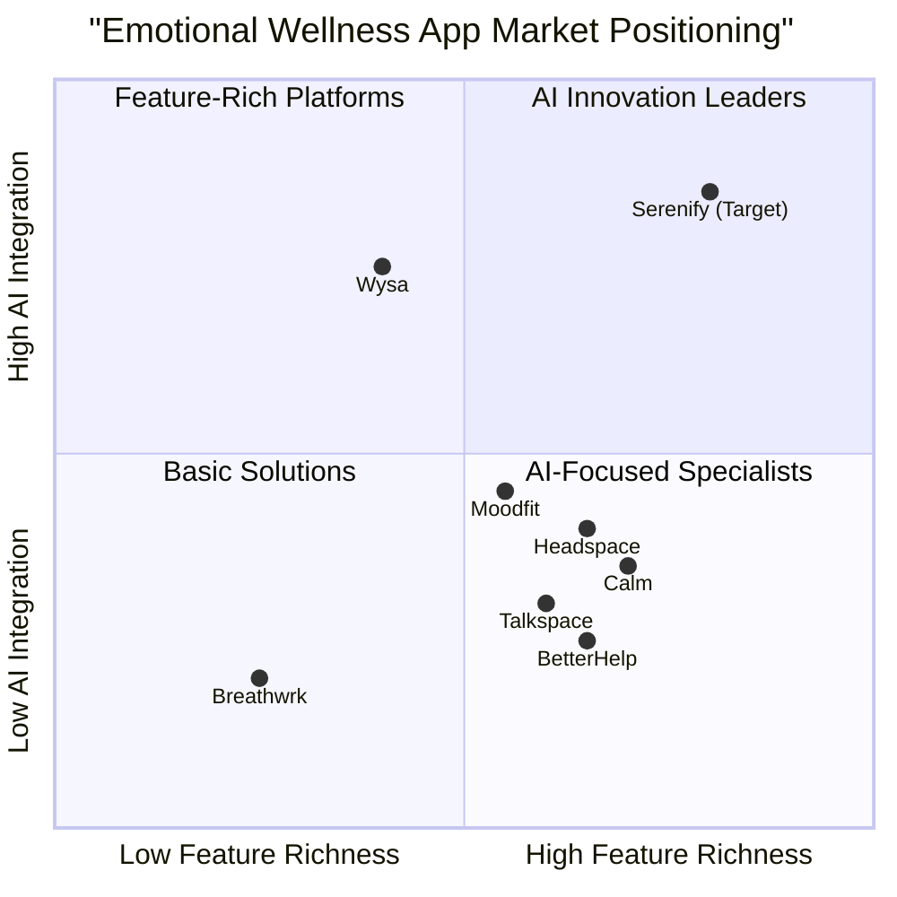
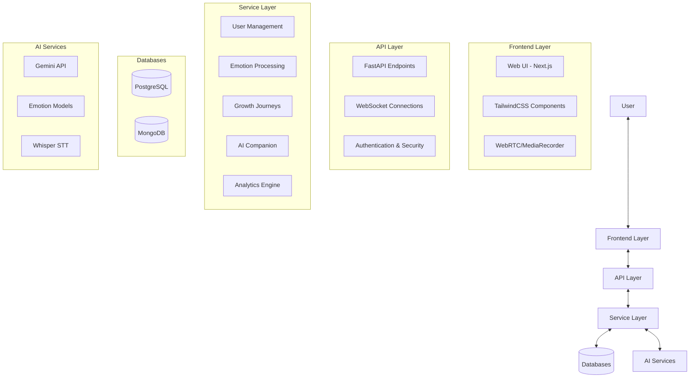

# Product Requirements Document (PRD)

## Serenify: AI-Powered Emotional Wellness Companion

**Date:** 2024-06-13
**Version:** 1.0

## Table of Contents

1. [Introduction](#introduction)
2. [Market Analysis](#market-analysis)
3. [User Personas](#user-personas)
4. [Product Definition](#product-definition)
5. [Features and Requirements](#features-and-requirements)
6. [Technical Specifications](#technical-specifications)
7. [Success Metrics](#success-metrics)
8. [Implementation Timeline](#implementation-timeline)
9. [Open Questions](#open-questions)

## Introduction

### Project Overview

Serenify is a web application that acts as a personalized emotional wellness companion, enabling users to understand, track, and improve their mental and emotional state using multimodal AI interactions. The system combines conversational AI, real-time facial emotion recognition, sentiment analysis, and guided growth features to provide a comprehensive emotional wellness platform.

### Problem Statement

In today's fast-paced world, individuals face increasing mental health challenges with limited access to professional support. Traditional mental health resources are often expensive, stigmatized, or inaccessible. Additionally, most people lack tools to effectively track, understand, and manage their emotional states in real-time, creating a gap in preventative mental wellness care.

### Solution

Serenify bridges this gap by offering an accessible, private, and intelligent emotional wellness companion that leverages cutting-edge AI technologies across multiple interaction modes (text, audio, video). By combining real-time emotion detection, personalized insights, and guided growth opportunities, Serenify empowers users to develop greater emotional awareness and resilience in their daily lives.

## Market Analysis

### Market Size and Growth

The global mental health apps market is experiencing significant growth, valued at approximately $7.2-7.5 billion in 2024 and projected to reach $17.5 billion by 2030, growing at a CAGR of 14.6-15.3%. The market expansion is driven by:

- Increasing awareness and reduced stigma around mental health
- Rising prevalence of mental health disorders globally
- Limited access to traditional mental healthcare services
- Growing smartphone penetration and internet accessibility
- Pandemic-induced mental health challenges continuing to drive adoption

North America dominates the market with approximately 36-39% market share, while the Asia Pacific region is experiencing the fastest growth rate due to increasing smartphone penetration and growing mental health awareness.

### Competitive Analysis

#### Key Competitors

| Competitor | Strengths | Weaknesses | Target Audience |
|------------|-----------|------------|----------------|
| **Headspace** | Strong meditation content, Sleep sounds, Brand recognition | Limited personalization, Focus primarily on meditation | Meditation beginners, General wellness seekers |
| **Calm** | Celebrity-narrated content, Comprehensive meditation library | Limited free version, Less feature innovation | Sleep-focused users, Meditation practitioners |
| **Moodfit** | Robust mood tracking, Cognitive restructuring tools | Limited multimedia experiences, Basic UI | CBT-focused users, Pattern trackers |
| **Wysa** | AI-powered chatbot, Evidence-based techniques | Limited human interaction, Primarily text-based | Budget-conscious users, Privacy-focused individuals |
| **Talkspace** | Licensed therapists, Insurance acceptance | High cost, Limited self-help tools | Users seeking professional help, Higher-income brackets |
| **BetterHelp** | Between-session communication, Mobile accessibility | Subscription model, Less focus on self-management | Therapy-seeking individuals, Support-focused users |
| **Breathwrk** | Specialized breathing techniques, Simple interface | Limited feature scope, One-dimensional approach | Anxiety sufferers, Mindfulness practitioners |

#### Competitive Positioning

### Market Trends

1. **Integration of AI and Machine Learning**: Increasing use of AI for personalized mental health experiences and predictive analytics
2. **Multimodal Interactions**: Growing trend toward combining multiple input methods (text, voice, video) for more natural user experiences
3. **Real-time Emotion Analysis**: Emerging technology using facial recognition and voice analysis to assess emotional states
4. **Personalized Growth Journeys**: Shift from generic content to adaptive, AI-customized wellness plans
5. **Corporate Wellness Initiatives**: Companies investing in employee mental health solutions
6. **Data Privacy Focus**: Enhanced emphasis on secure handling of sensitive mental health data
7. **Integration with Wearables**: Connection with fitness trackers and smartwatches for holistic health monitoring

### Target Market

Serenify targets the following market segments:

1. **Primary Segment**: Young professionals (25-40) experiencing stress and anxiety seeking accessible mental wellness tools
2. **Secondary Segment**: Mindfulness practitioners looking for technology-enhanced emotional awareness
3. **Tertiary Segment**: Corporate wellness programs seeking scalable mental health solutions for employees

### Market Differentiators

Serenify's unique position in the market is defined by:

1. **Comprehensive Multimodal Approach**: Unlike competitors focusing on single modalities, Serenify combines text, audio, and video for a more holistic experience
2. **Advanced Real-time Emotion Recognition**: Superior technology for capturing emotional states through facial expressions during interactions
3. **Personalization Engine**: AI that adapts more deeply to individual emotional patterns and needs than current market offerings
4. **Integration of Multiple Wellness Frameworks**: Combining techniques from CBT, mindfulness, positive psychology and other evidence-based approaches
5. **Growth Journey Framework**: Structured yet flexible emotional growth plans that evolve based on user progress

## User Personas

### Persona 1: Alex - The Stressed Professional

**Demographics:**
- 32 years old
- Marketing Manager
- Urban dweller, single

**Goals:**
- Find ways to manage daily work stress
- Develop better emotional awareness
- Create healthy work-life boundaries

**Pain Points:**
- Experiences frequent anxiety but doesn't have time for therapy
- Difficulty recognizing stress triggers in the moment
- Struggles with sleep due to racing thoughts

**Usage Pattern:**
- Uses app primarily in evenings after work
- Prefers quick check-ins and guided breathing exercises
- Values privacy and data security

### Persona 2: Maya - The Mindfulness Practitioner

**Demographics:**
- 38 years old
- Yoga instructor
- Suburban, married with one child

**Goals:**
- Deepen emotional intelligence
- Track meditation progress
- Discover patterns in emotional wellness

**Pain Points:**
- Existing apps lack depth for advanced practitioners
- Wants more personalized growth recommendations
- Needs reminders to practice throughout busy days

**Usage Pattern:**
- Uses app multiple times daily
- Engages deeply with journaling features
- Enjoys exploring new growth journey content

### Persona 3: Jordan - The Emotional Intelligence Explorer

**Demographics:**
- 26 years old
- Graduate student
- Lives in college town, shares apartment

**Goals:**
- Better understand emotional responses
- Build resilience through structured activities
- Connect emotions to behavior patterns

**Pain Points:**
- Difficulty articulating feelings
- Limited budget for mental health support
- Inconsistent in maintaining wellness practices

**Usage Pattern:**
- Heavy user of facial emotion analysis feature
- Prefers voice journaling over text
- Uses app spontaneously throughout day

### Persona 4: Samira - The Corporate Wellness Manager

**Demographics:**
- 45 years old
- HR Director at mid-size company
- Urban professional

**Goals:**
- Find scalable wellness solution for employees
- Measure program effectiveness with anonymous data
- Promote preventative mental health practices

**Pain Points:**
- Needs solution that respects employee privacy
- Requires data to demonstrate ROI to leadership
- Must accommodate diverse employee preferences

**Usage Pattern:**
- Administrative access to program analytics
- Limited personal use focused on testing features
- Interested in integration with existing wellness programs

## Product Definition

### Product Goals

1. **Enhance Emotional Self-Awareness**: Empower users to recognize, understand, and track their emotional states through multimodal AI interactions that provide real-time insights and patterns over time.

2. **Facilitate Emotional Growth**: Guide users through personalized emotional wellness journeys with adaptive recommendations based on their unique emotional patterns, preferences, and progress.

3. **Create Accessible Mental Wellness Support**: Provide an accessible, private alternative to traditional mental health resources through an intelligent AI companion that offers empathetic interaction and evidence-based techniques.

### User Stories

1. **As a busy professional**, I want to quickly check in about my emotional state using my webcam, so that I can recognize stress patterns before they escalate.

2. **As a mindfulness practitioner**, I want to record voice reflections and receive AI analysis of my emotional tone, so that I can gain deeper insights into my subconscious feelings.

3. **As someone working on emotional regulation**, I want personalized breathing exercises and meditation recommendations based on my detected emotional state, so that I can effectively address negative emotions in the moment.

4. **As a person tracking my mental health journey**, I want visualizations of my emotional patterns over time, so that I can identify triggers and measure my progress.

5. **As someone who struggles to articulate feelings**, I want an empathetic AI companion I can chat with about my day, so that I can process emotions in a judgment-free environment.

### Competitive Analysis

| Feature Category | Serenify | Headspace | Calm | Wysa | Talkspace | Moodfit |
|------------------|----------|-----------|------|------|-----------|--------|
| **Multimodal Input** | Text, audio, video | Text only | Text, audio | Text only | Text, video | Text only |
| **Emotion Recognition** | Real-time facial + voice | None | None | Text sentiment | Video sessions only | None |
| **AI Companion** | Advanced LLM-based | None | None | Rule-based AI | Human therapist | None |
| **Personalized Growth** | Adaptive AI-driven | Fixed programs | Fixed programs | Limited adaptation | Therapist-guided | Self-directed |
| **Wellness Tracking** | Multimodal pattern analysis | Basic meditation tracking | Sleep and meditation tracking | Mood tracking | Session-based | Comprehensive mood tracking |
| **Data Visualization** | Advanced pattern recognition | Basic stats | Basic stats | Simple charts | None | Moderate charts |
| **Pricing Model** | Freemium with subscription | Subscription | Freemium with subscription | Freemium with subscription | Premium only | Freemium |

### Competitive Quadrant Chart

## Features and Requirements

### 1. Multimodal Input & Output

#### Feature Description
Serenify provides a seamless user experience by accepting and producing multiple forms of interaction - text, audio, and video - allowing users to engage through their preferred communication modality in different contexts.

#### Requirements

**Text Input**
- **Must** provide a journaling interface with rich text editing capabilities
- **Must** include a chatbot interface for conversational interactions
- **Must** support sentiment analysis of text entries
- **Should** offer prompts and suggestions based on previous entries
- **Should** include templates for different reflection purposes (gratitude, stress analysis, etc.)
- **May** support handwriting recognition for uploaded journal images

**Audio Input**
- **Must** allow voice recordings up to 5 minutes in length
- **Must** transcribe voice inputs to text using Whisper or equivalent STT model
- **Must** analyze emotional tone from voice patterns
- **Should** extract key themes and sentiments from voice journals
- **Should** support background noise filtering for clear recordings
- **May** provide real-time feedback during voice recording sessions

**Video Input**
- **Must** access webcam with explicit user consent
- **Must** perform real-time facial emotion analysis
- **Must** store emotional data while ensuring privacy (no raw video storage)
- **Should** work in variable lighting conditions
- **Should** provide immediate visual feedback about detected emotions
- **May** support multiple face detection for group sessions

**Text Output**
- **Must** generate empathetic responses using GEMINI API
- **Must** offer personalized insights based on emotional patterns
- **Must** provide actionable recommendations tailored to emotional state
- **Should** adapt tone based on detected user emotional state
- **Should** offer both concise and detailed response options

**Audio Output**
- **Must** support text-to-speech for accessibility
- **Should** offer voice selection options (different tones/accents)
- **Should** include calming sounds/music library
- **May** generate adaptive music based on emotional state

**Visual Output**
- **Must** display emotional trend graphs and patterns
- **Must** include guided breathing exercise visualizations
- **Must** show progress through growth journeys
- **Should** offer customizable dashboard views
- **Should** include calming visual backgrounds/themes
- **May** support AR relaxation environments on compatible devices

### 2. Real-Time Facial Emotion Analysis via Webcam

#### Feature Description
Serenify's real-time emotion detection system uses computer vision technology to analyze facial expressions and provide immediate emotional insights, creating an effortless way for users to track and understand their emotional states without manual logging.

#### Requirements

**Webcam Access and Processing**
- **Must** request explicit permission before accessing webcam
- **Must** provide clear visual indicator when webcam is active
- **Must** process video frames locally before any cloud transmission
- **Must** allow users to disable or enable facial analysis feature
- **Should** optimize for low CPU/GPU usage
- **Should** function in variable lighting conditions

**Emotion Detection Technology**
- **Must** utilize DeepFace or equivalent CNN model for emotion classification
- **Must** detect 7 basic emotions: happiness, sadness, anger, fear, surprise, disgust, neutral
- **Must** provide confidence scores for detected emotions
- **Should** detect emotion intensity/valence
- **Should** establish baseline emotional patterns for individual users
- **May** detect micro-expressions for subtle emotion changes

**User Experience and Feedback**
- **Must** display current detected emotion in real-time
- **Must** provide visual feedback through simple, intuitive UI
- **Must** avoid judgment language in emotion reporting
- **Should** show emotion transitions over session duration
- **Should** offer opt-in emotion snapshot feature
- **May** provide haptic feedback on emotion changes (mobile)

**Data Handling and Privacy**
- **Must** process facial data without storing raw video
- **Must** anonymize and encrypt all emotion data
- **Must** provide clear data usage explanations
- **Must** allow complete deletion of historical facial analysis data
- **Should** offer adjustable data retention periods
- **Should** provide transparency into emotion detection confidence levels

### 3. Personalized Growth Journeys

#### Feature Description
Serenify provides structured yet adaptive emotional wellness programs that evolve based on the user's progress, preferences, and emotional patterns, delivering a guided path to achieving specific emotional wellness goals.

#### Requirements

**Journey Structure and Content**
- **Must** offer preset journeys for different goals (stress reduction, anxiety management, emotional awareness)
- **Must** provide 7/14/30-day program options
- **Must** include diverse activity types (reflection prompts, breathing exercises, guided meditations)
- **Should** offer specialized journeys for different emotional challenges
- **Should** include expert-designed content from psychological frameworks
- **May** allow community-created journey templates (moderated)

**Personalization and Adaptation**
- **Must** adapt journey content based on user progress and feedback
- **Must** adjust difficulty/intensity based on user emotional patterns
- **Must** provide alternative activities when users dislike suggestions
- **Should** leverage AI to create personalized activity variations
- **Should** recognize user preferences for activity types
- **May** generate completely custom journeys based on user goals

**Progress Tracking and Gamification**
- **Must** track completion of journey activities
- **Must** provide visual progress indicators
- **Must** offer streak mechanics for consistent usage
- **Should** include milestone celebrations
- **Should** provide shareable achievement certificates
- **May** include optional challenge components

**Integration with Other Features**
- **Must** incorporate data from emotion tracking into journey recommendations
- **Must** synchronize with user's emotional wellness tracking
- **Should** suggest specific journeys based on detected emotional patterns
- **Should** utilize AI companion for journey guidance
- **May** connect with calendar for scheduled activities

### 4. Emotional Wellness Tracking

#### Feature Description
Serenify's tracking system combines explicit user inputs with AI-detected emotional data to create comprehensive emotional wellness insights, helping users identify patterns, triggers, and progress over time.

#### Requirements

**Mood Logging**
- **Must** provide quick emoji-based mood check-in
- **Must** support detailed emotion logging with intensity scales
- **Must** allow activity and context tagging
- **Should** offer customizable emotion categories
- **Should** suggest potential triggers based on patterns
- **May** support location-based mood tracking

**Pattern Analysis**
- **Must** generate weekly and monthly emotional trend reports
- **Must** identify correlations between activities and emotions
- **Must** detect recurring emotional patterns
- **Should** predict potential emotional triggers
- **Should** compare patterns to baseline and show improvement
- **May** incorporate external factors (weather, news events) in analysis

**Visualization and Reporting**
- **Must** provide clear, intuitive emotion visualizations
- **Must** offer different chart types (line, radar, calendar heatmap)
- **Must** allow custom date range selection
- **Should** enable comparison between time periods
- **Should** offer printable/exportable reports
- **May** support sharing insights with trusted contacts/professionals

**Integration with Detection Systems**
- **Must** incorporate facial emotion detection data
- **Must** integrate voice sentiment analysis
- **Must** combine explicit and implicit emotional data
- **Should** weight different data sources appropriately
- **Should** allow users to validate or correct AI-detected emotions
- **May** leverage wearable data when available

### 5. AI-Powered Companion

#### Feature Description
Serenify's AI companion provides a responsive, empathetic presence that offers emotional support through natural conversations, guided activities, and personalized recommendations based on the user's emotional state and history.

#### Requirements

**Conversational Capabilities**
- **Must** use GEMINI API for natural language understanding and generation
- **Must** maintain conversation context and history
- **Must** respond with empathy to emotional disclosures
- **Should** recognize and address critical mental health concerns
- **Should** adapt communication style to user preferences
- **May** support voice conversations with natural prosody

**Personalization and Memory**
- **Must** remember user preferences and previous interactions
- **Must** recall user's emotional patterns and triggers
- **Must** adapt responses based on user history
- **Should** recognize user growth and acknowledge progress
- **Should** build a model of user's emotional vocabulary
- **May** remember special dates and follow up appropriately

**Supportive Interactions**
- **Must** offer evidence-based coping strategies for negative emotions
- **Must** provide gentle encouragement for positive practices
- **Must** suggest appropriate interventions based on emotional state
- **Should** offer different support styles (listener, coach, guide)
- **Should** recognize user achievements and milestones
- **May** simulate different therapeutic approaches (CBT, ACT, etc.)

**Safety and Ethics**
- **Must** include crisis detection and appropriate referrals
- **Must** clearly identify as an AI assistant, not a human or therapist
- **Must** avoid diagnostic language or medical advice
- **Must** maintain appropriate boundaries in conversations
- **Should** provide transparent limitations of AI capabilities
- **Should** offer opt-out for sensitive conversation topics

## Technical Specifications

### Requirements Analysis

Developing the Serenify application requires expertise in modern web development, AI integration, computer vision, and secure data handling. The application will be built as a responsive web application with potential for future mobile expansion.

### System Architecture

### Technology Stack

Based on the requirements, the following technology stack will be utilized:

**Frontend:**
- Next.js (React) for the core application
- TailwindCSS for UI components and responsive design
- WebRTC/MediaRecorder API for video/audio capture
- Chart.js/D3.js for data visualizations

**Backend:**
- FastAPI (Python-based) for API endpoints
- WebSockets for real-time communication
- JWT-based authentication

**AI Services:**
- Gemini API for conversational AI and content generation
- DeepFace or custom CNN model for video emotion detection
- Whisper for speech-to-text transcription
- Custom sentiment analysis pipelines

**Databases:**
- PostgreSQL for user profiles, structured data, and relationships
- MongoDB for unstructured data (journal entries, conversation history)

**Storage:**
- Cloudinary/Firebase/AWS S3 for media storage (when necessary)

**DevOps:**
- Docker for containerization
- CI/CD pipeline with GitHub Actions
- AWS/GCP for hosting

### Requirements Pool

#### P0 (Must-have / MVP features)

1. **User Authentication & Profile**
   - Secure account creation and authentication
   - Basic profile management
   - Privacy settings

2. **Text-based Interaction**
   - Journaling interface
   - Basic chatbot functionality
   - Text sentiment analysis

3. **Basic Emotional Tracking**
   - Manual mood logging
   - Simple trend visualization
   - Daily check-in reminders

4. **Simple Growth Journeys**
   - Pre-defined 7-day journeys
   - Progress tracking
   - Basic activity completion

5. **Core AI Companion**
   - Basic conversational capabilities
   - Empathetic responses
   - Simple recommendations

#### P1 (Should-have / Important features)

1. **Audio Input/Output**
   - Voice recording and transcription
   - Voice emotion analysis
   - Text-to-speech capabilities

2. **Enhanced Emotion Tracking**
   - Pattern recognition
   - Trigger identification
   - Comparative analysis

3. **Advanced Growth Journeys**
   - Adaptive journey content
   - 14 and 30-day programs
   - Enhanced gamification

4. **Enhanced AI Companion**
   - Memory of previous interactions
   - Personalized recommendations
   - Multiple conversation styles

5. **Dashboard and Insights**
   - Advanced visualizations
   - Custom date ranges
   - Exportable reports

#### P2 (Nice-to-have / Future enhancements)

1. **Video-based Emotion Detection**
   - Real-time facial emotion analysis
   - Emotion history tracking
   - Visual feedback system

2. **Advanced Personalization**
   - ML-based adaptive content
   - Personalized growth algorithms
   - User preference learning

3. **Integration Capabilities**
   - Calendar integration
   - Wearable device connections
   - Professional sharing options

4. **Community Features**
   - Anonymous community support
   - User-generated content (moderated)
   - Group journeys

5. **Advanced Multimedia**
   - Guided visualization videos
   - Custom audio environments
   - AR relaxation spaces

### UI Design Draft

**Key UI Principles:**
- Clean, minimalist design with calming color palette
- Intuitive navigation with minimal cognitive load
- Responsive design for all device sizes
- Accessibility-first approach
- Visual feedback for emotional states

**Core Screens:**

1. **Dashboard / Home**
   - Current emotional state visualization
   - Quick access to journaling, companion, and daily activities
   - Progress highlights and streaks
   - Personalized recommendations

2. **Emotional Check-in**
   - Multiple input options (text, voice, video)
   - Simple emotion selection interface
   - Optional context and intensity inputs
   - Immediate feedback and suggestions

3. **Journal Space**
   - Rich text editor with templates
   - Voice recording option
   - Emotion tagging
   - AI insights on entries

4. **AI Companion Interface**
   - Chat-like interface with conversation history
   - Suggestion chips for conversation topics
   - Multimedia response options
   - Emotion feedback indicators

5. **Growth Journey Center**
   - Visual journey paths
   - Activity cards with completion tracking
   - Progress visualization
   - Journey selection and customization

6. **Insights & Analytics**
   - Emotion trend graphs (daily, weekly, monthly)
   - Pattern visualizations
   - Activity correlations
   - Recommendation highlights

## Success Metrics

To measure Serenify's success and impact, we will track the following key metrics:

### User Engagement Metrics

1. **User Retention**
   - Day 1, 7, 30 retention rates
   - Weekly and monthly active users (WAU/MAU)
   - Average session length
   - Target: 40% 30-day retention rate (industry benchmark: 25-30%)

2. **Feature Usage**
   - Feature adoption rates across modalities (text, audio, video)
   - Completion rates for growth journey activities
   - Conversation depth with AI companion
   - Target: 70% of users engaging with at least 3 different features weekly

3. **User Activity**
   - Frequency of emotional check-ins
   - Journal entry frequency and length
   - Growth journey completion rates
   - Target: Average 4 weekly check-ins per active user

### User Impact Metrics

1. **Emotional Wellness Improvement**
   - Shifts in reported emotional states over time
   - Reduction in reported negative emotional states
   - Increase in emotional self-awareness (survey-based)
   - Target: 60% of users reporting improved emotional awareness after 30 days

2. **User-Reported Outcomes**
   - Net Promoter Score (NPS)
   - User satisfaction ratings
   - Self-reported benefit measures
   - Target: NPS score of 40+ after 90 days of usage

3. **Behavioral Changes**
   - Adoption of recommended coping strategies
   - Consistent usage patterns
   - Engagement with challenging activities
   - Target: 50% of users adopting at least one recommended strategy consistently

### Business Performance Metrics

1. **Growth Metrics**
   - User acquisition rate and cost
   - Conversion rate from free to paid tiers
   - Word-of-mouth referrals
   - Target: 15% conversion to paid tier within 60 days of signup

2. **Retention and Revenue**
   - Monthly recurring revenue (MRR)
   - Customer lifetime value (LTV)
   - Churn rate
   - Target: Monthly churn rate below 5%

3. **Product Quality**
   - Bug reports and resolution time
   - Feature request patterns
   - System stability and uptime
   - Target: 99.9% system uptime, bug resolution within 48 hours

## Implementation Timeline

The development of Serenify will follow a phased approach, focusing on delivering core value quickly and expanding features over time.

### Phase 1: MVP Development (Months 1-3)

**Month 1: Foundation and Core Features**
- Set up development environment and infrastructure
- Implement user authentication and basic profiles
- Develop basic journaling and mood tracking interfaces
- Integrate initial Gemini AI conversational capabilities

**Month 2: Essential Features Development**
- Complete text-based interaction features
- Implement basic emotional tracking visualization
- Develop simple 7-day growth journeys
- Create core AI companion functionality

**Month 3: Testing and Refinement**
- Conduct internal testing and QA
- Implement feedback mechanisms
- Refine user flows and fix identified issues
- Prepare for beta launch

### Phase 2: Beta Launch and Enhancement (Months 4-6)

**Month 4: Beta Launch**
- Limited user beta launch
- Implement analytics tracking
- Begin collecting user feedback
- Address critical issues

**Month 5: P1 Features Development**
- Implement audio input/output capabilities
- Enhance emotion tracking with pattern recognition
- Develop 14-day growth journeys
- Improve AI companion personalization

**Month 6: Dashboard and Analytics**
- Complete enhanced visualizations and reporting
- Implement advanced insights generation
- Develop exportable reports
- Prepare for public launch

### Phase 3: Public Launch and Advanced Features (Months 7-12)

**Month 7-8: Public Launch and Stabilization**
- Full public launch of core and P1 features
- Marketing and user acquisition activities
- Performance optimization and scaling
- Continued refinement based on user feedback

**Month 9-10: Advanced Features Development**
- Implement video-based emotion detection
- Develop advanced personalization algorithms
- Create 30-day specialized growth journeys
- Enhance AI companion capabilities

**Month 11-12: Integration and Expansion**
- Implement integration capabilities (calendar, wearables)
- Develop initial community features
- Create advanced multimedia content
- Plan for mobile app development

## Open Questions

### Technical Considerations

1. **Emotion Detection Accuracy**
   - What level of accuracy can we achieve in real-world conditions with variable lighting, camera quality, etc.?
   - How do we handle edge cases where emotion detection may be unreliable?
   - Should we incorporate user feedback to improve algorithm accuracy?

2. **Data Privacy and Security**
   - What is the optimal approach for processing sensitive facial data while maintaining privacy?
   - How do we balance personalization with data minimization principles?
   - What additional security measures are needed for especially sensitive user data?

3. **AI Response Appropriateness**
   - How do we ensure AI responses are appropriate for users in vulnerable emotional states?
   - What guardrails should be implemented for crisis detection and intervention?
   - How do we handle potential misuse of the AI companion?

### Product Considerations

1. **Feature Prioritization**
   - Should we prioritize breadth (more features) or depth (better core experiences) in early versions?
   - Is there a minimum viable version of the video emotion detection that could be included earlier?
   - Which specific growth journey topics should be prioritized for initial release?

2. **Personalization Strategy**
   - How quickly should the system adapt to user patterns?
   - What is the right balance between automated personalization and user control?
   - How do we measure the effectiveness of personalization algorithms?

3. **Business Model Considerations**
   - Which features should be included in free vs. premium tiers?
   - What price points will balance accessibility with sustainable revenue?
   - Should we explore B2B offerings for corporate wellness programs?

### User Experience Considerations

1. **Onboarding Experience**
   - How do we explain the value proposition clearly during onboarding?
   - What is the minimum information needed from users to provide value immediately?
   - How do we address potential privacy concerns during the setup process?

2. **User Retention Strategies**
   - What notification and reminder strategy will maintain engagement without becoming intrusive?
   - How do we effectively communicate the value of consistent usage?
   - What milestone recognition will be most motivating for different user segments?

3. **Feature Discovery**
   - How do we encourage users to explore all modalities (text, audio, video)?
   - What progressive disclosure strategy should we implement for advanced features?
   - How do we measure successful feature adoption across the platform?
